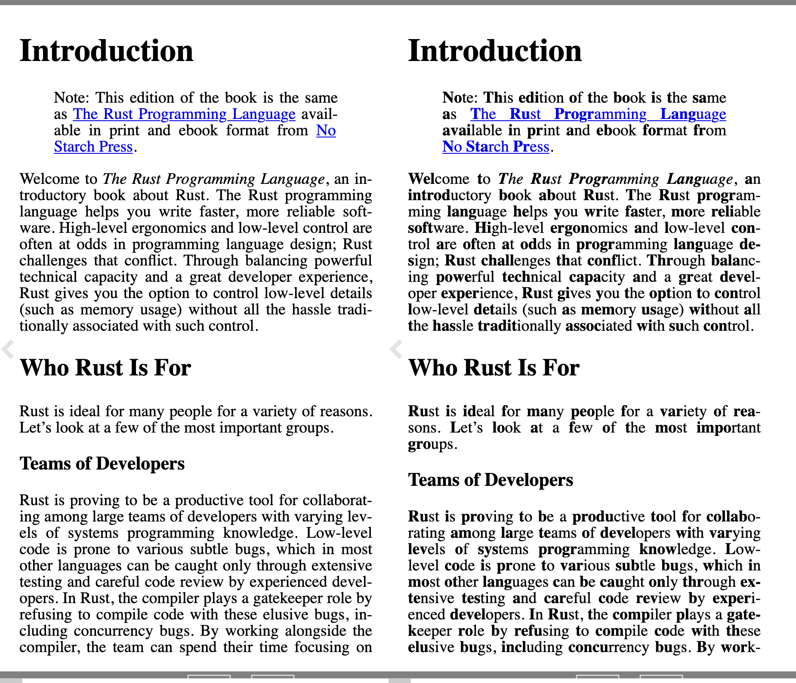

# Bioniconv

Bioniconv is a single pass bionic reading converter for epub files.
It is written in Rust for single threaded performance. 

Example usage:

```sh
$ cargo build --release
$ ./target/release/bioniconv path/to/file.epub
```

It produces new file in a current working directory with the same name as the input file but with `bionic_` prefix.

The image below shows before and after conversion of a page from a book.



## Performance

On my machine the King James Bible epub file, 1.7MiB of compressed text, was converted in less than a second.

```sh
$ time ./target/release/bioniconv ~/Downloads/pg10900.epub

real    0m0.937s
user    0m0.589s
sys     0m0.041s
```
